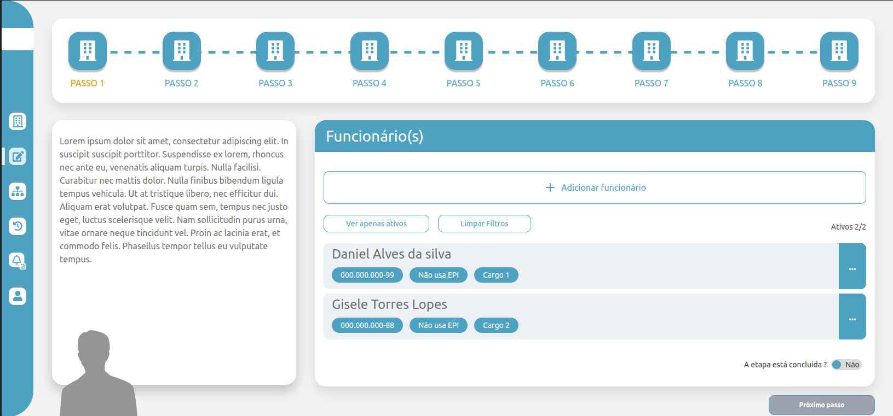
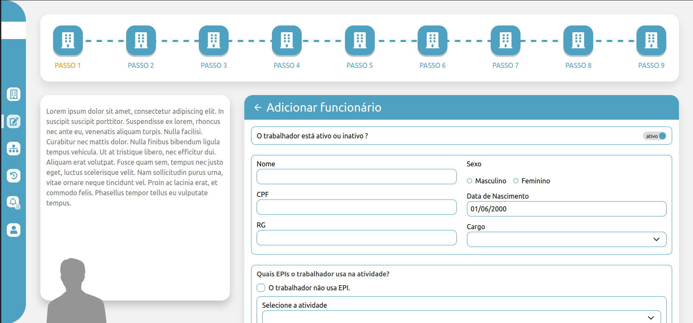
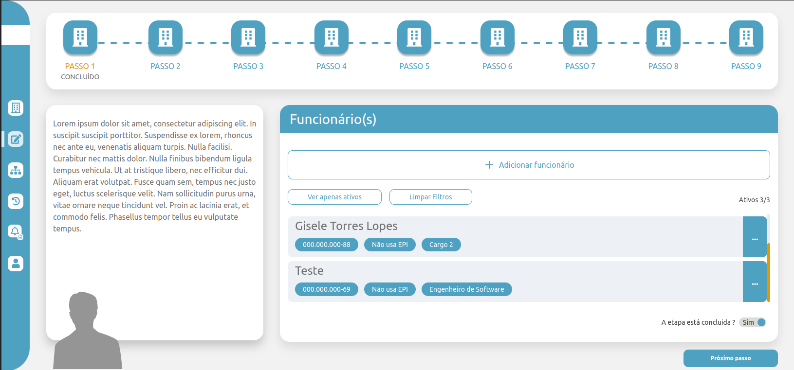

# Teste técnico React 

Projeto para teste técnico na SEA tecnologia feito em ReactJs.


## Requisitos

- Utilizar preferencialmente React.
- Persistir as informações.
- Estar de acordo com o protótipo.
- Manter no estado da aplicação se a etapa foi concluída ou não, conforme switch no rodapé da página.
- As requisições deverão ser mantidas nas actions.
- Funcionar nos principais navegadores.

** Protótipo -
<a href="https://www.figma.com/file/gGePjuPTHdH7pISofjrzxB/Desafio-React?type=design&node-id=0-1&mode=design&t=HfN28mNsQ75SVp1P-0" target="_blank"> 
Figma
</a>

### Sugestões 

- Utilizar o Redux 
- Utilizar o ant design
- Utilizar o json server server para fazer o back end. 


## Possiveis Melhorias

 - Adicionar página para editar usuário.
 - Adicionar autenticação.
 - Adicionar novas etapas no formulário.
 - Adicionar novas rotas no dashboard.
 - Utilizar uma api padrão REST.


## Rodando localmente

Clone o projeto

```bash
  git clone https://github.com/zkauansantos/SEA-test.git
```

Entre no diretório do projeto

```bash
  cd SEA-test
```

Instale as dependências

```bash
  npm install ou yarn
```

Inicie o servidor fake em json-server

```bash
  yarn json-server --watch ./src/database/db.json
```

Ou se preferir instalar globalmente 
```bash
  npm i -g json-server

  json-server --watch ./src/database/db.json
```

Inicie o front-end

```bash
  yarn dev
```

Visualize a aplicação em seu navegador em http://localhost:5173


## Layout 

- Dashboard Etapa não concluída - Passo 1
[]()

- Form 
[]()

- Dashboard etapa concluída
[]()

- Dashboard etapa concluída - Passo 2
[]()


## Documentação da API fake json-server

#### Retorna todos os funcioários.

```http
  GET /employees
```

#### Cadastra um funcionário.

```http
  POST /employees
```

| Corpo   | Tipo       | Descrição                                   |
| :---------- | :--------- | :------------------------------------------ |
| `name`      | `string` | **Obrigatório**. Nome do funcionário |
| `cpf`      | `string` | **Obrigatório**. Cpf do funcionário |
| `rg`      | `string` | **Obrigatório**. RG do funcionário |
| `genre`      | `string` | **Obrigatório**. Gênero do funcionário |
| `dateOfBirth`      | `string` | **Obrigatório**. Data de nascimento |
| `empPosition`      | `string` | **Obrigatório**. Cargo do funcionário |
| `usesEPI`      | `string` | **Obrigatório**. Se usa EPI ou não |
| `EPIS`      | `array [{EPI: string, activity: string, numberCA: string}]` | **Opicional**. Se marcar que não usa epi |
| `medicalCerticalCerificateFile`      | `string / null` | **Opicional**. Nome da foto enviada |
| `isActive`      | `boolean` | **Obrigatório**. Se funcionário está ativo. |


#### Retorna todos as atividades pré cadastradas no json-server.

```http
  GET /activities
```

#### Retorna todos as epis pré cadastradas no json-server.


```http
  GET /epis
```

#### Retorna todos os cargos pré cadastrados no json-server.

```http
  GET /positions
```


## Tecnologias Utilizadas

- React
- Typescript
- Tailwindcss
- React hook form
- React Query
- Redux 
- Zod
- Radix-ui


## Feedback

Projeto legal de realizar, acredito que poderia ter mais telas pra construir então deixei margem para evolução, podendo mudar a lógica das etapas então não estendi muito.

Apesar do Redux ser apenas uma sugestão utilizei ele para guardar o estado do dashboard como o formulário visível, a etapa concluida, os passos concluídos.

Também adicionei uma nova tela que não tinha no protótipo para quando o usuário clicar no botão de "próximo passo". Pra conseguir ao menos uma experiência melhor da aplicação e um feedback visual, o botão que consta nela zera todos os estados da aplicação e começa tudo do zero.


## Autores

- [@zkauansantos](https://www.github.com/zkauansantos)

